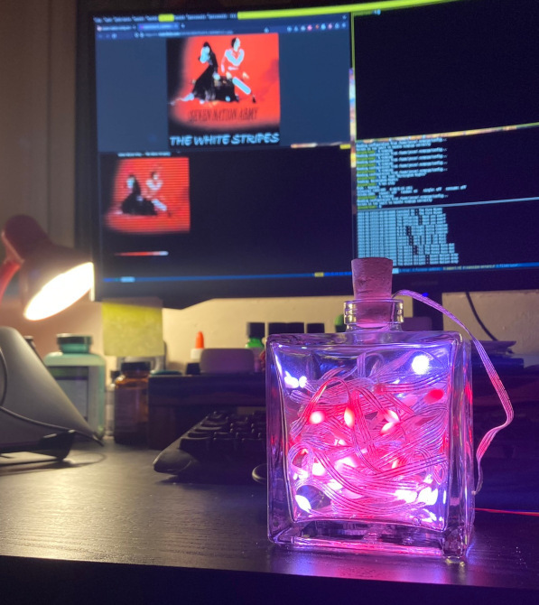

# Album art bottle LEDs

I got a [Pimoroni Wireless Plasma Kit](https://shop.pimoroni.com/products/wireless-plasma-kit?variant=40372594704467) and wanted to do something fun with it!  I had the idea to create a custom palette of colors based on what I was listening to!

Album art is often iconic and I thought it'd be cool to get a subtle hint of the colors of my favorite album covers as their songs play!

I realized that last.fm shares album art over its API and as a long time member, that seemed like a great place to start.

By combining code for API access, dominant color extraction, NeoPixel updates and socket networking I was able to throw this together in an evening.

### Materials
* The [Pimoroni Wireless Plasma Kit](https://shop.pimoroni.com/products/wireless-plasma-kit?variant=40372594704467) which acts as a server
* A 'real' computer (client) to generate palettes via API calls
* A last.fm account to pull from
* A last.fm API key
* A CLI tool for checking the currently playing song (eg mpc/mpd)

### Workflow

I really wish the pico could do all of the image processing but jpeg decoding let alone kmeans is probably a tall order...so I arrived at this slightly hacky client/server architecture.

The client code (running on a 'real' computer) does most of the heavy lifting by:
* Checking last.fm for the most recently scrobbled track
* Downloading it's cover art
* Extract the `NUM_COLORS` most common colors
* Padding that out to `NUM_LEDS` and sending the udpdate to the server.

The server code, running on the pico, is resonsible for:
* Accepting "palette" updates (which are a list of `NUM_LED` RGB values)
* Managing the LED colors

### Running the project
* Have a look at the constants at the top of the client / server and see if you wanna make any adjustments
* Install the libraries in `requirements.txt` on your client
* Use thonny or something like it to run the server code on the pi
	* It'll glow green when it's ready for a client connection
* Run the client code (once you add the API key and username) on a 'real' computer to send palettes to the server

### Good Stuff
* Gentle animation is nice
* Because the pico has wifi, it can be anywhere in your home!  On a high shelf, even.  Wireless is cool :-)
* The updates are pretty slick
* Once a palette has been recieved it'll keep on displaying it until a new one is recieved.
* Pretty pleased by the threading code on the pico for handling animation and network updates :-)

### Future Work
* Would be AWESOME to change the animation speed based on the BPM of the song but this isn't available in the last.fm API!  I'd probably need to bridge in another API...
* It's possible having all the LEDs stuff into a bottle isn't given the best sense of the palette -- might look cool mounted on a wall or somewhere else!
